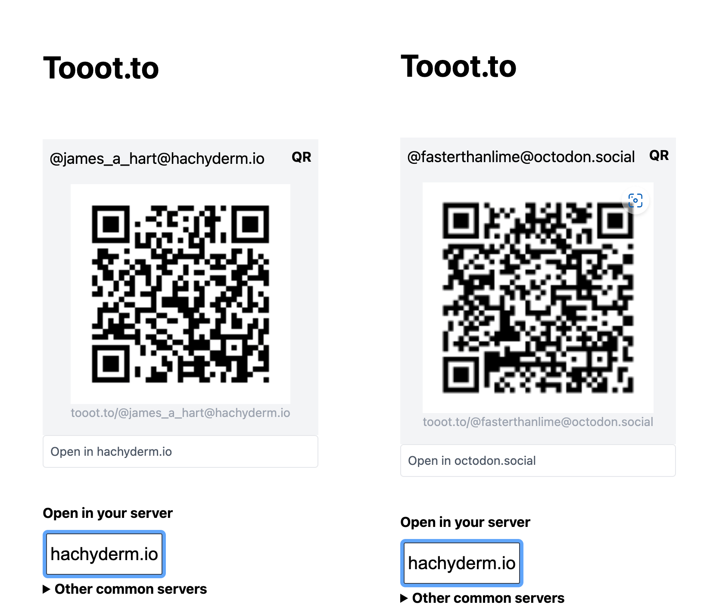

# tooot.to

Until the devs add it directly to Mastodon, I created tooot.to to make it easier
to link from websites outside of Mastodon into your Mastodon instance. You can
put `tooot.to/` before any profile URL in the wild and it will let you click
through to your own server more easily. e.g.
https://tooot.to/https://mastodon.social/web/@TodePond or
https://tooot.to/https://hachyderm.io/web/@computerfact@botsin.space

As well, you can share a `tooot.to` URL of any profile handle so it's easier for
others coming from other sites. e.g. I'm at https://tooot.to/@colel@hachyderm.io



**Features**

- Prefix `tooot.to/` Redirections
  - From handles: [`@colel@hachderm.io`](https://tooot.to/@colel@hachderm.io)
  - From mispelled handles:
    [`colel@hachderm.io`](https://tooot.to/@colel@hachderm.io) or
    [`hachderm.io@colel`](https://tooot.to/@colel@hachderm.io)
  - From your logged in /web/ URLs:
    [`https://hachderm.io/web/@colel`](https://tooot.to/https://hachderm.io/web/@colel)
- QR Code generation for easy IRL sharing
- Local HTTP only cookie for preferred instance
- No JavaScript necessary to use
- No JavaScript necessary to use

### Usage

Start the project:

```
deno task start
```

This will watch the project directory and restart as necessary.

## Contributing

### Is a redirection not working?

- Look into the [`REDIRECTORS` in _404.tsx route](routes/_404.tsx)

### Is a preference not being saved?

- Look into the
  [`setPrefCookie` in shared/setPrefCookie.tsx](shared/setPrefCookie.tsx), or
- Look into the
  [`getToootCookies` in shared/getToootCookies.tsx](shared/getToootCookies.tsx)

### Is a QR code sucky?

- Look into the [`generate_qr_code` in the Rust lib](rs_lib/src/lib.rs)

TODO:

- [ ] Make QR codes not blurry (should be pixel aligned)
- [ ] Move `tooot.to/@toLabel` text to QR Code from handoff.tsx
